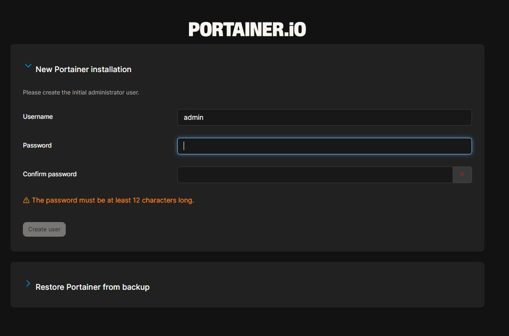
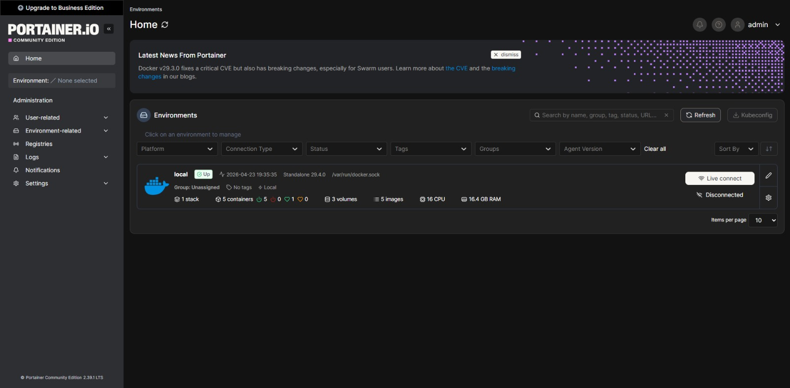
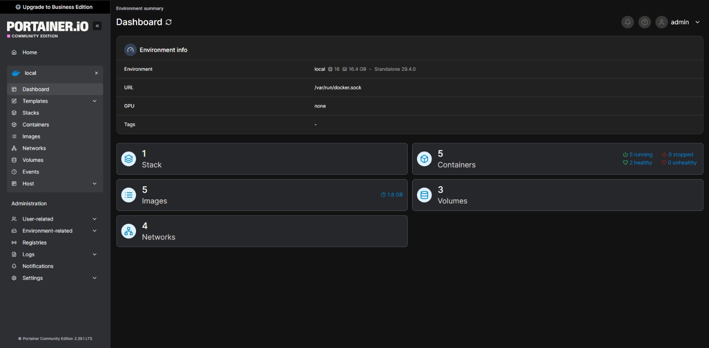
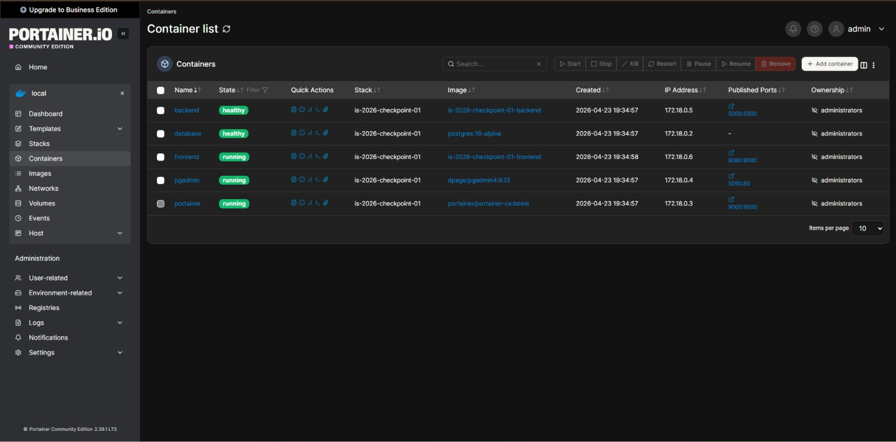

# is-2026-checkpoint-01

Este es el repositorio para el Checkpoint 01 de la materia Ingeniería y Calidad de Software.

## Integrantes
| Felipe Pianelli | 31477 | Feature 01 | Coordination - Compose - README |
| Santiago Sereno | 31481 | Feature 02 | Frontend |
| Federico Alvarez Pieroni | 31147 | Feature 03 | Backend |
| Tiago Solis | 33374 | Feature 04 | Database - PgAdmin |
| Facundo Gomez | 32874 | Feature 05 | Portainer |

## Prerrequisitos
 
- **Docker** 24 o superior
- **Docker Compose** v2 (viene incluido en Docker Desktop)
- **Git**
Probado en Windows 11 con WSL2 + Docker Desktop, y en Linux nativo.
 
---
 
## Cómo levantar el proyecto
 
### 1. Clonar el repositorio
 
```bash
git clone https://github.com/fpianelli/is-2026-checkpoint-01.git
cd is-2026-checkpoint-01
```
 
### 2. Crear el archivo `.env`
 
Copiá la plantilla y completá con los valores que quieras:
 
```bash
cp .env.example .env
```
 
Los valores por defecto del `.env.example` son placeholders descriptivos. 
 
### 3. Levantar todos los servicios
 
```bash
docker compose up -d --build
```
 
El primer arranque tarda 1-2 minutos porque tiene que descargar las imágenes y construir las de frontend y backend. PgAdmin tarda un rato más en arrancar, si se inicia inmediatamente después de correr docker compose up no va a funcionar. Se debe esperar mínimo un minuto. 
 
### 4. Verificar que todos los contenedores están corriendo
 
```bash
docker compose ps
```
---

## URLs de acceso
 
| Frontend   | http://localhost:8080 |
| Backend    | http://localhost:5000/api/team | devuelve JSON con integrantes  |
| Portainer  | http://localhost:9000      | 
| pgadmin    | http://localhost:5050      | Credenciales en `.env`  

---
 
## Servicios
 
### Frontend 
Página HTML simple servida por `python3 -m http.server`. El archivo `app.js` usa `fetch()` para consultar el endpoint `/api/team` del backend y renderiza la tabla de integrantes dinámicamente. Incluye un indicador visual del estado del backend (Online / Offline).
 
### Backend 
API REST escrita en Flask, servida con Gunicorn. Expone tres endpoints:
- `GET /api/health` — estado del servicio (usado por el HEALTHCHECK de Docker)
- `GET /api/info` — metadata del servicio
- `GET /api/team` — lista de integrantes leída desde la tabla `members` de PostgreSQL
 
### Database 
PostgreSQL 16 Alpine. Se inicializa automáticamente al primer arranque mediante el script `database/init.sql`, que crea la tabla `members` e inserta una fila por cada integrante. Los datos persisten en el volumen nombrado `db_data`.
 
### Portainer 
Panel web para monitorear los contenedores Docker sin usar la terminal. Se comunica con el daemon de Docker montando el socket `/var/run/docker.sock`. Su configuración persiste en el volumen `portainer_data`.
 
### pgadmin — herramienta auxiliar
Interfaz gráfica para administrar la base de datos durante el desarrollo. No forma parte de las features oficiales del Checkpoint 01. Se utilizó para hacer pruebas de eliminar registros en la base de datos y ver reflejados esos cambios en el frontend.
 
---

### Primer acceso a Portainer y capturas de pantalla
1. Login 

2. Home

3. Dashboard 

4. Los 5 contenedores
